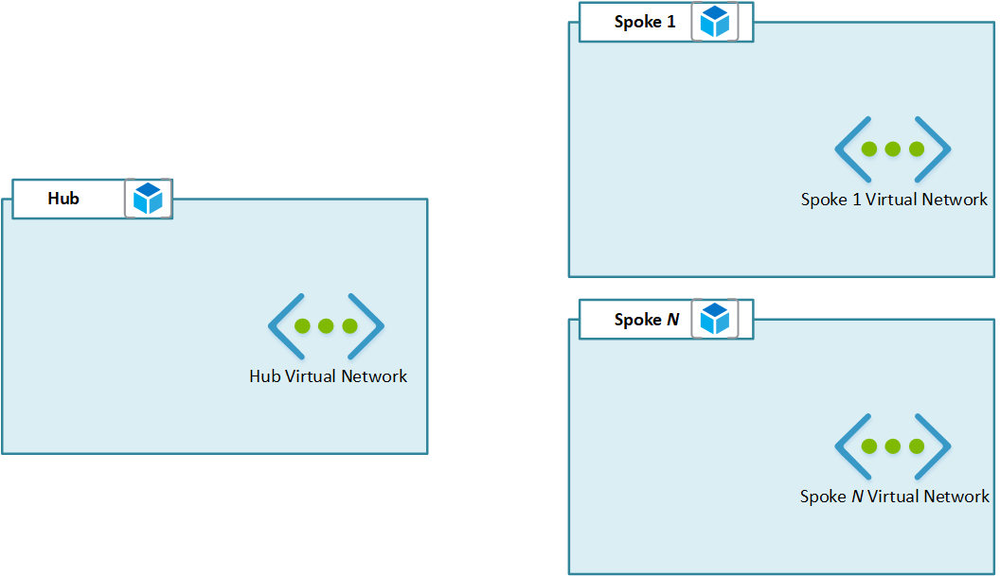

# dxAzureHubAndSpoke

Hub and spoke architecture deployment within Azure for resource groups, virtual networks, subnets, and route table.  Include in deployment and add virtual appliances, routes, and security controls, as required.

<!-- BEGIN_TF_DOCS -->
## Requirements

No requirements.

## Providers

| Name | Version |
|------|---------|
|  [azurerm](#provider\_azurerm) | 2.70.0 |

## Modules

No modules.

## Resources

| Name | Type |
|------|------|
| [azurerm_resource_group.hub](https://registry.terraform.io/providers/hashicorp/azurerm/latest/docs/resources/resource_group) | resource |
| [azurerm_resource_group.spokes](https://registry.terraform.io/providers/hashicorp/azurerm/latest/docs/resources/resource_group) | resource |
| [azurerm_route_table.rt](https://registry.terraform.io/providers/hashicorp/azurerm/latest/docs/resources/route_table) | resource |
| [azurerm_subnet.hub-subnets](https://registry.terraform.io/providers/hashicorp/azurerm/latest/docs/resources/subnet) | resource |
| [azurerm_subnet.spoke-subnets](https://registry.terraform.io/providers/hashicorp/azurerm/latest/docs/resources/subnet) | resource |
| [azurerm_virtual_network.hub](https://registry.terraform.io/providers/hashicorp/azurerm/latest/docs/resources/virtual_network) | resource |
| [azurerm_virtual_network.spokes](https://registry.terraform.io/providers/hashicorp/azurerm/latest/docs/resources/virtual_network) | resource |
| [azurerm_virtual_network_peering.hub-to-spokes](https://registry.terraform.io/providers/hashicorp/azurerm/latest/docs/resources/virtual_network_peering) | resource |
| [azurerm_virtual_network_peering.spokes-to-hub](https://registry.terraform.io/providers/hashicorp/azurerm/latest/docs/resources/virtual_network_peering) | resource |

## Inputs

| Name | Description | Type | Default | Required |
|------|-------------|------|---------|:--------:|
|  [DNS\_SERVERS](#input\_DNS\_SERVERS) | DNS servers for Azure virtual networks. | `list(string)` | `[]` | no |
|  [HUB](#input\_HUB) | Representation of the network hub. | <pre>object({         name          = string         address_space = list(string)         subnets      = map(object({             address_prefixes = list(string)             private_link     = bool         }))     })</pre> | n/a | yes |
|  [LOCATION](#input\_LOCATION) | Azure region for deployment. | `string` | n/a | yes |
|  [NAMING\_CONVENTION](#input\_NAMING\_CONVENTION) | Naming convention format | `string` | `"prefix{{KEY}}{{TYPE}}"` | no |
|  [RG\_TYPE](#input\_RG\_TYPE) | Naming convention representation for a resource group. | `string` | `"rg"` | no |
|  [RT\_TYPE](#input\_RT\_TYPE) | Naming convention representation for a route table. | `string` | `"rt"` | no |
|  [SPOKES](#input\_SPOKES) | Representation of the network spokes. | <pre>map(object({         address_space = list(string)         subnets       = map(object({             address_prefixes = list(string)             private_link     = bool         }))     }))</pre> | n/a | yes |
|  [TAGS](#input\_TAGS) | Tags to assign to managed resources. | `object({})` | <pre>{   "CreatedBy": "Terraform",   "TFModule": "Hub-and-Spoke" }</pre> | no |
|  [USE\_REMOTE\_GATEWAYS](#input\_USE\_REMOTE\_GATEWAYS) | Use for routing from spokes through hub. | `bool` | `false` | no |
|  [VNET\_TYPE](#input\_VNET\_TYPE) | Naming convention representation for a virtual network. | `string` | `"vnet"` | no |

## Outputs

| Name | Description |
|------|-------------|
|  [HUB\_RG](#output\_HUB\_RG) | Managed hub resource group. |
|  [HUB\_SUBNETS](#output\_HUB\_SUBNETS) | Managed hub subnets. |
|  [HUB\_VNET](#output\_HUB\_VNET) | Managed hub virtual network. |
|  [RT](#output\_RT) | Managed routing table. |
|  [SPOKES\_RG](#output\_SPOKES\_RG) | Managed spokes resource groups. |
|  [SPOKES\_SUBNETS](#output\_SPOKES\_SUBNETS) | Managed spokes subnets. |
|  [SPOKES\_VNET](#output\_SPOKES\_VNET) | Managed spokes virtual networks. |
<!-- END_TF_DOCS -->